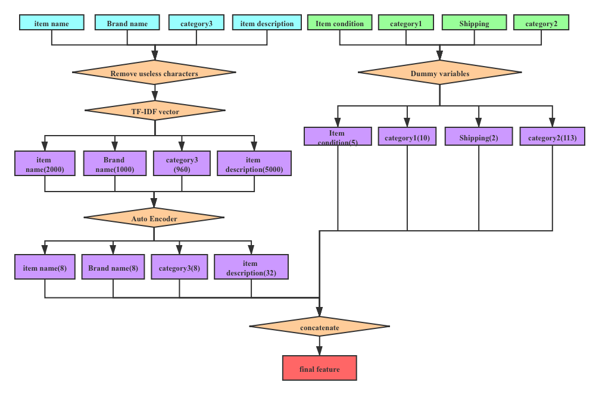
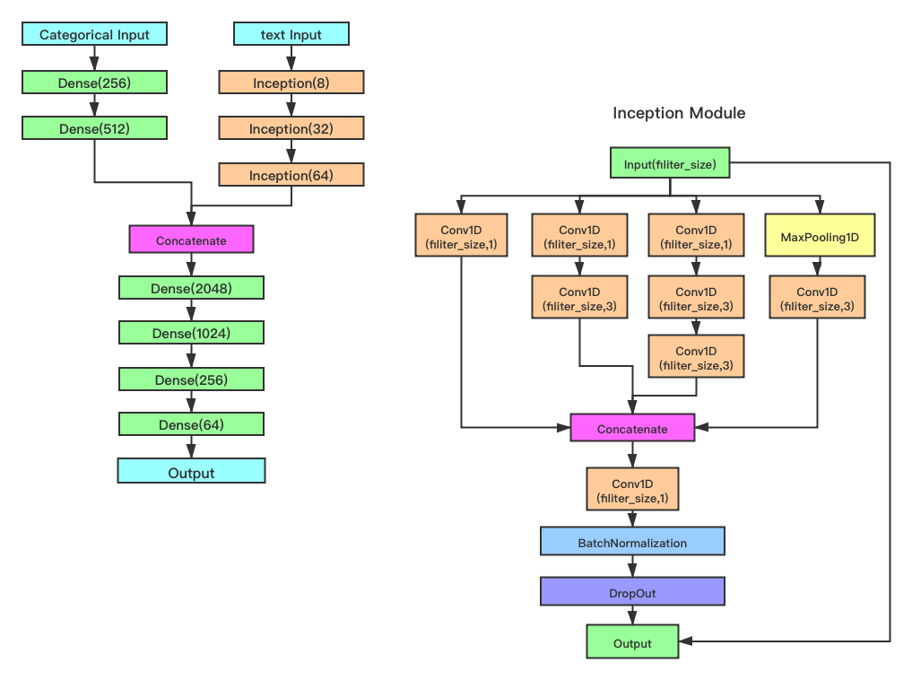

# CIA-Price-Recommendation-System
This project is for ESE529 course project, Washington University in St.Louis.  We build a online secondary product price recommendation system build on Kaggle's Mercari dataset, the website for dataset and description is in [Kaggle Competition](https://www.kaggle.com/c/mercari-price-suggestion-challenge/overview).

### 1. introduction

You can view the final system through. Based on the dataset, we use machine learning and deep learning technique to construct prediction workflow to transform and predict price using information user provide with us. In the system, you can input the information about your product, like the name, brand, category, description, etc. Then, system will give you a reasonable price based on information

### 2. Model Construction Workflow

#### 2.1 Dataset

We describe dataset first. For the training dataset,there are total six predictive variables in data and one response variable:
  `name`: the name of the item.
  `item_condition_id`: an integer specify the condition of item. There are total five condition:1,2,3,4,5.
  `category_name`: a string describe the category of item.
  `brand name`: a string describe the brand of item.
  `shipping`: 1 if shipping fee is paid by seller and 0 by buyer.
  `item_description`: a sectence describe the item inputed by seller.
  `price`: the price that the item was sold for.
 There are total 1482535 data in train dataset.  For preprocessing, we split the variable `category_name` to three level called `category1`, `category2` and `category3` respectively. 

#### 2.2 Feature Construction

For the feature construction, in order to increase the accuracy of system, we implement ensemble idea by construct different type of features and use these feature to build model respectively. Then, we combine all the model and give final prediction. To be more specific, we construct four type of model, named final, logical, stem and combine respectively. below are how we construct them:

##### Final feature

##### Logical Feature

##### Stem Feature

##### Combine Feature

Actually, when bulid the model, we found that the final feature would give us best performance among four type of feature. 

For auto encoder, the structure is follow:

#### 2.3 Model Construction

For model construction, we first use final feature to evaluate different model and parameters. We test Random Forest, XGBoost, DNN and CNN. Evaluation strategy is follow: we divide total training dataset to new training and new test dataset with ratio 0.7/0.3. Then, we construct model and do the 5-folds cross validation on the new training dataset. For evaluation metric, we use Root Mean Squared Logarithmic Error(RMSLE), the formula is follow:

Finally we choose the XGBoost and CNN as our final model. Actually DNN and CNN have best performance in cross validation. However, the size of deep learning model is much larger than model like XGBoost. Thus, for model construction, we finally train four XGBoost model use four type of features. Meanwhile, to further increase the accuracy, we train a single CNN model use final feature. The structure of CNN is follow:

Finally, we combine result of five model prediction with another XGBoost to get our final prediction of price.  For the final XGBoost, we use all the data in new training dataset to train five model, then we use the preidiction for new test dataset of five model as new input data to train and evaluate XGBoost use 5-folds cross-validation.

### 3. System Construction

After we evaluate all the model, we finally train all the model using all the training dataset with the parameters we get in validation. These models then be embedded to the system use to predict price for new product. The workflow of system is follow:

 

### 4. Limitation

However, although we spend lot's of time try to buila a very huge and complexed system, with the wish that such a system would give us more accuracy and robust prediction for new data. However, turns out it is not the case. The performance is not very good compare to the leaderboard in Kaggle. And such a hug system make prediction procedure become slow. We think one of the reason lay on the process of data. All the single model trained on one of feature have bad performance indicate that there are some problem for feature construction. We may need spend more time to dig into it and construct feature that would have better performance even if we only use single model.

### 5. Contact

Jiarui Feng: jiarui.feng@wustl.edu

Zhiling Zhang: zhilingzhang@wustl.edu

